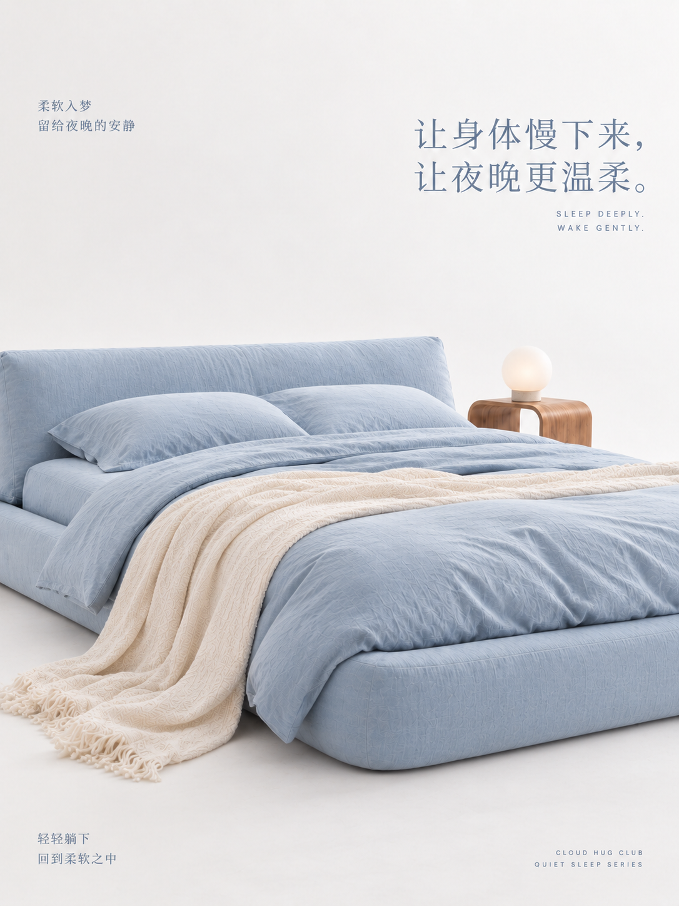
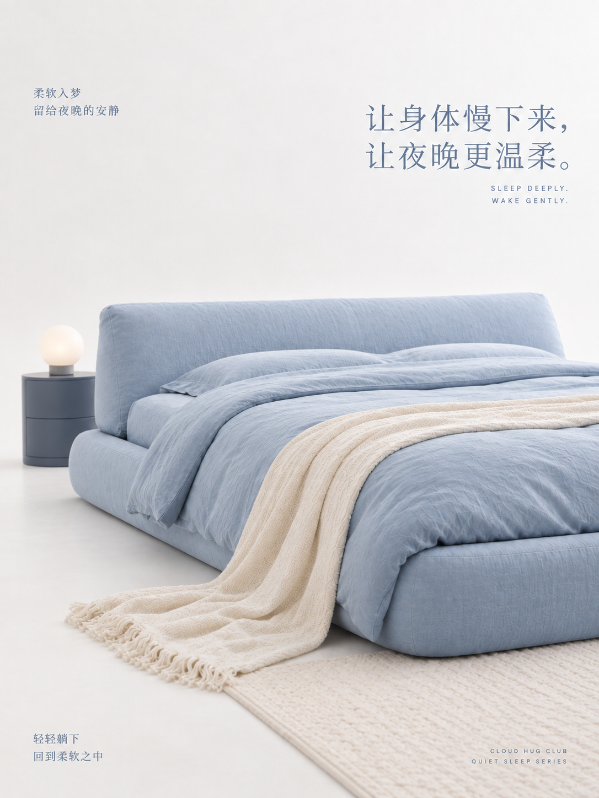
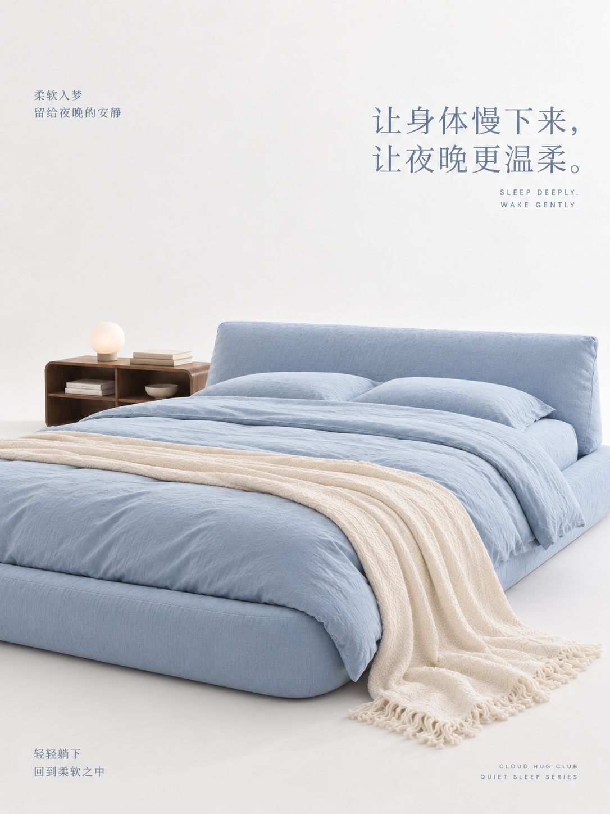
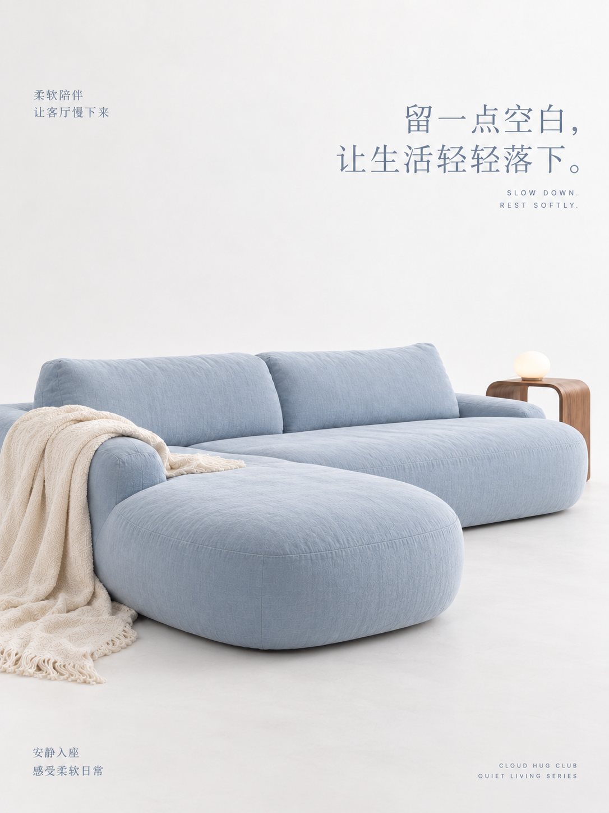
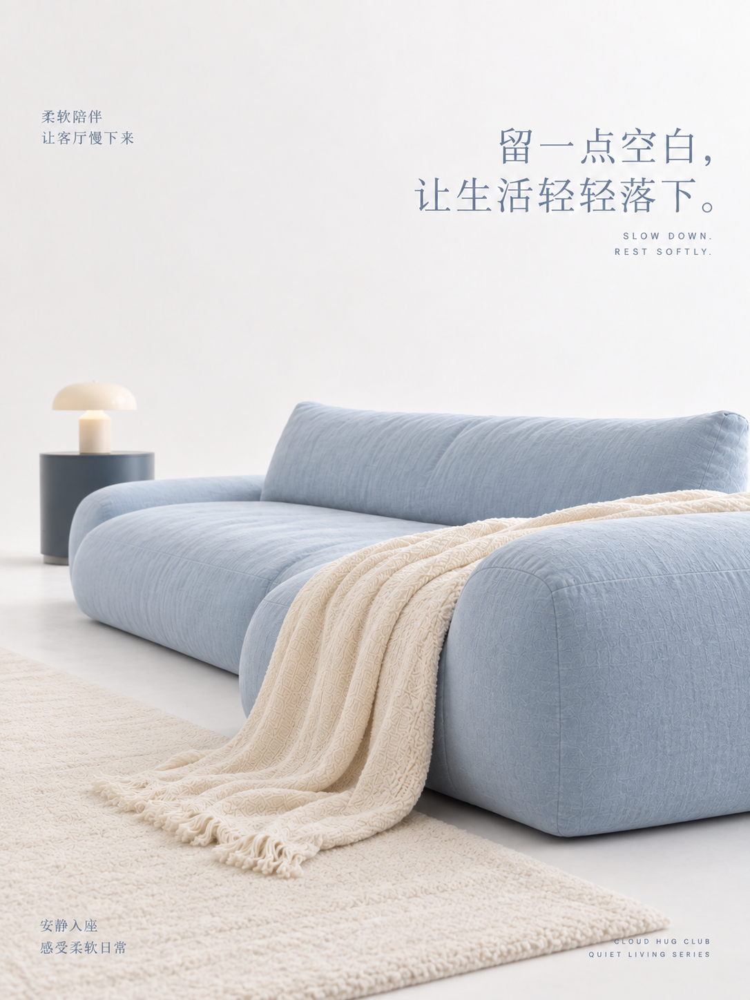
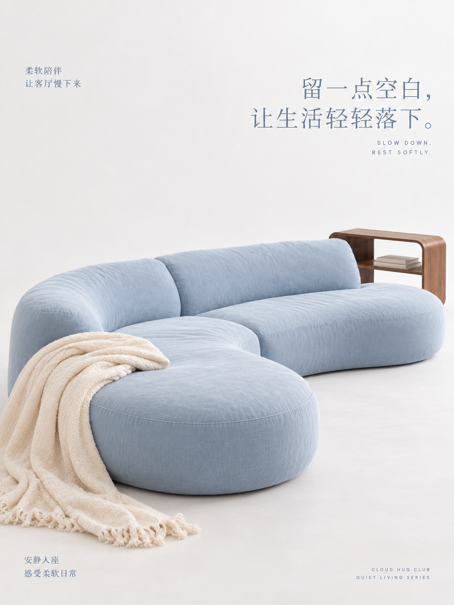

# reference-style-restyler：在 SealSeek 中安装与使用

这款 npm 包为已有图片提供可选的视觉预设。输入一张图片，输出一张同像素尺寸的新图片。默认预设是「白场蓝色功能岛」：保留原图的人物、产品和文案内容，重新设计场景、构图、光线与文案排版。

## 在 SealSeek 中用提示词安装

把下面一句话发送给 SealSeek。安装与 Skill 接入由插件完成：

```text
安装 @petercjl/reference-style-restyler
```

如有同名的自建 Skill，插件会保留原内容并提示处理。图片生成使用 SealSeek 当前已授权的能力。

## 手动更新

插件会自动检查最新稳定版，并更新已接入的 Skill。需要立即更新时，发送：

```text
更新 @petercjl/reference-style-restyler
```

更新完成后可继续使用，无需重新提供风格说明。

## 输入一张图片

附上一张图片，并发送下面一句话；若使用本地图片，在句末补上 SealSeek 能读取的图片路径：

```text
用 @petercjl/reference-style-restyler 处理这张图片。
```

一次任务输入一张图片。可以通过 `reference-style-restyler preset list --json` 查看方案；指定其他方案时，在提示词中填写预设 ID 或准确名称。

## 默认预设：白场蓝色功能岛

画面采用暖白无边界背景和浅灰白地面，低饱和雾蓝色的床、沙发或软榻构成唯一的大型功能岛。一件小面积、略深的木色或灰蓝家具稳定色调。人物和产品自然进入功能岛的使用关系；上方保留舒展留白，文案以纤细蓝灰色字体组织。光线接近阴天天光或大型柔光棚：明亮、漫射、低对比，形成安静柔软的安睡氛围。

卧室参考图：







客厅参考图：







这六张图展示预设的空间、光影与排版语言；具体生成时，输入图片中的人物、产品和文案内容仍是保真依据。
